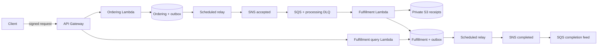

# Serverless Commerce — Java 21 / Spring Boot 4

A runnable reference implementation of **contracted-customer digital order acceptance and fulfillment registration**. It implements two independently persisted bounded contexts, five Lambda functions, versioned events, transactional outboxes, retry-safe S3 receipts, and an actual API-to-SQS-to-Lambda workflow.

This scope accepts purchase orders and records fulfillment receipts. It does **not** charge payment cards, reserve finite inventory, deliver product downloads or send emails. Those capabilities would introduce additional business contexts and integration contracts.

**Verified locally:** 35 unit tests, 7 Testcontainers integration tests, deployed E2E and retry/DLQ checks pass. Terraform manages 108 resources and reports no changes after reconciliation. See the [validation ledger](docs/validation.md) for evidence and remaining AWS gates.

## Start here

- [Business requirements, domain ownership and eight architecture diagrams](docs/design.md)
- [All 20 implementation phases and checkpoints](docs/phases.md)
- [Architecture decisions](docs/adr/README.md)
- [API and event contracts](docs/contracts/openapi.json)
- [Testing and failure matrix](docs/testing.md)
- [Security, Lambda performance, production deployment and runbooks](docs/operations.md)
- [Dependency compatibility and authoritative references](docs/compatibility.md)
- [Executed verification and remaining production gates](docs/validation.md)
- [Interview questions and 30-second / 60-second / 2-minute explanations](docs/interview.md)

## Architecture



Atomicity stops at each context's DynamoDB transaction. Publishing is at least once. A durable outbox closes the database/publication gap; conditional state changes and immutable receipt keys make duplicate work safe. No AWS or Spring dependency exists in either domain.

## Requirements

JDK 21, Docker, AWS CLI v2, Python 3, Terraform 1.9–1.x and internet access for dependency/image downloads. The Maven wrapper is included. Tested baseline: Boot 4.1.1, SDK 2.54.7, LocalStack 4.12.0, Terraform 1.13.5 / AWS provider 6.0.0. Pins and upgrade limitations are documented in [compatibility](docs/compatibility.md).

## Build and run

```bash
# macOS, if necessary:
export JAVA_HOME=$(/usr/libexec/java_home -v 21)

./mvnw -B clean verify

docker compose up -d --wait
./scripts/init-localstack.sh

./mvnw -B -Pintegration verify
python3 scripts/e2e.py
python3 scripts/failure-e2e.py
```

For OrbStack, set `DOCKER_SOCK="$HOME/.orbstack/run/docker.sock"` before Compose. Testcontainers may also need `DOCKER_HOST="unix://$HOME/.orbstack/run/docker.sock"` and `TESTCONTAINERS_DOCKER_SOCKET_OVERRIDE=/var/run/docker.sock`.

The provisioner builds the deployment ZIP, reconciles Terraform against **LocalStack only**, and writes endpoint/resource outputs to `.local/outputs.json`. Repeating it reconciles the same resources. The integration profile starts a separate isolated Testcontainers emulator. Default `verify` runs unit tests without Docker; it does not silently claim integration coverage.

### Place an order locally

```bash
API_URL=$(terraform -chdir=infrastructure/terraform output -state=../../.local/terraform.tfstate -raw api_url)
curl -sS "$API_URL/orders" \
  -H 'Content-Type: application/json' \
  -H 'Idempotency-Key: demo-order-001' \
  -d '{"items":[{"sku":"JAVA-GUIDE","quantity":2},{"sku":"AWS-GUIDE","quantity":1}]}'
```

A `202` response contains `orderId`, `status=ACCEPTED`, a USD total of 99.70 and a fulfillment URL. Read `/orders/{id}` and poll `/fulfillments/{id}` until `COMPLETED`; the latter may initially return 404. Scheduled publication can take a minute at each outbox hop. The E2E script performs the complete polling and storage verification automatically.

Catalog: `JAVA-GUIDE` costs USD 29.90; `AWS-GUIDE` costs USD 39.90. The server ignores client price fields. A repeated key with identical items returns the original order; different items return 409. Local requests use one fixed customer. Real AWS ingress requires signed IAM authentication and owner-scoped access.

### Commands

| Command | Result |
|---|---|
| `make build` | Unit tests and Lambda ZIP |
| `make integration` | Unit tests plus Testcontainers adapter tests |
| `make local provision` | Start/reconcile local AWS resources |
| `make e2e` | Deployed success/replay/state assertions |
| `make failures` | Deployed retry/DLQ fault test, local only |
| `make validate` | Core dependency checks and Terraform validation |

Artifact: `runtime/target/commerce.zip`, containing classes at ZIP root and dependencies under `lib/`. A fixed `project.build.outputTimestamp` makes release artifacts reproducible; change it together with release version when creating a new release.

## Repository

```text
contracts/          Framework-free integration envelopes and payloads
ordering-core/      Order domain, catalog, use cases and repository port
fulfillment-core/   Fulfillment domain, use cases and repository/receipt ports
runtime/            Context-owned AWS adapters, Lambda handlers, Spring wiring
infrastructure/     Terraform resources and provider lockfile
scripts/            Provisioning, architecture checks, E2E and fault injection
docs/               Requirements, diagrams, contracts, ADRs, phases and runbooks
```

One ZIP is deployed into five isolated functions with separate IAM roles. This reduces build machinery while preserving runtime/data ownership; independent artifacts can follow separate team release cadences. Package-by-context keeps business ownership clear, with layers inside each context and Maven dependency direction around the cores.

## Production boundary

The repository implements production-style reliability mechanisms. LocalStack success is **not production certification**. Real AWS IAM/KMS enforcement, signed API access, notification delivery, tracing, cold-start/load targets, restore and rollback require staging verification. No AWS account deployment is performed by the local scripts. Follow the exact remaining checks in [validation](docs/validation.md) and the [production runbook](docs/operations.md).
