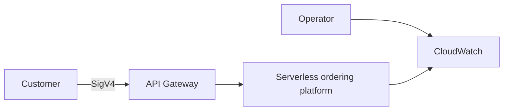
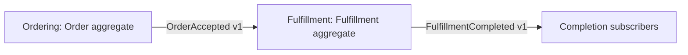
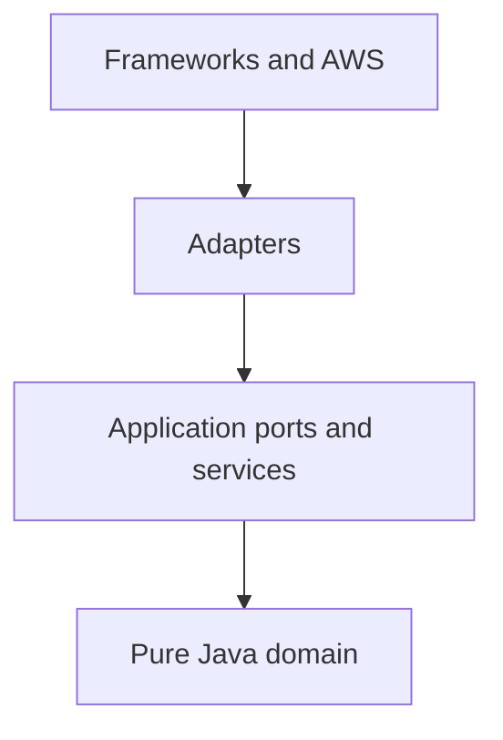
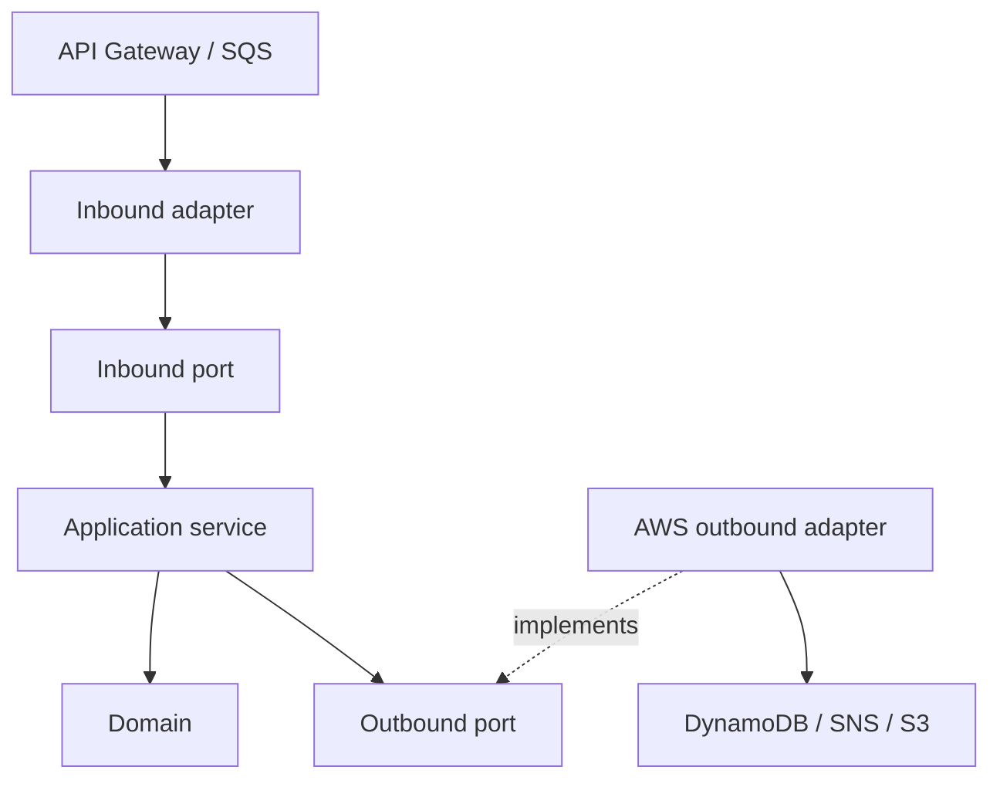
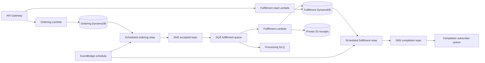
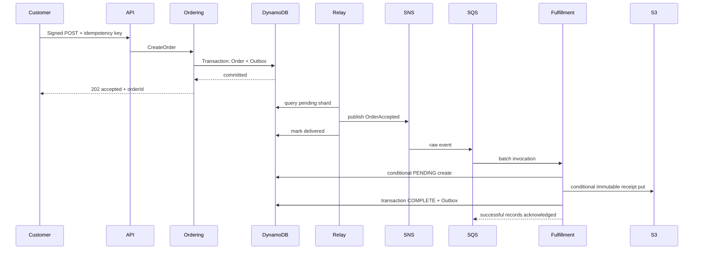
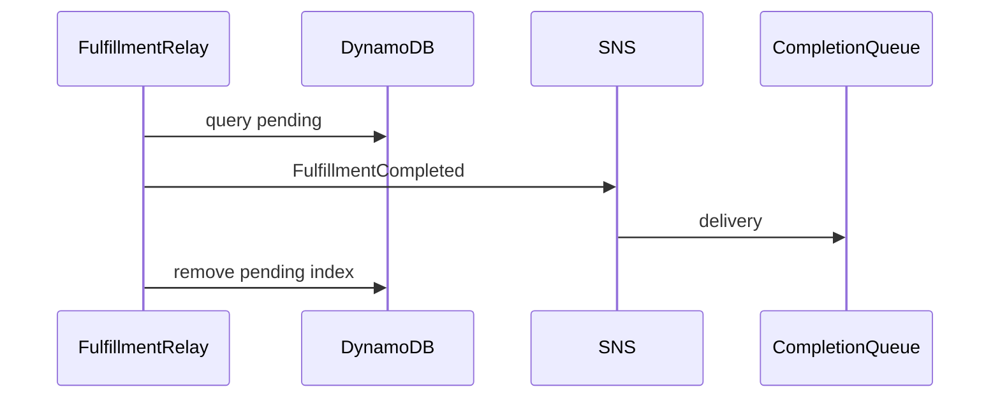

# Business and architecture baseline

## Phase 01: requirements

Goal: durable digital-product ordering and asynchronous fulfillment for a small B2B catalog.
Actors: authenticated customer (IAM principal), platform operator, downstream completion-event subscriber.
Workflow: POST order → accepted order → transactional outbox → SNS → SQS → fulfillment → immutable S3 receipt →
completion outbox → SNS → completion queue. GET order and GET fulfillment provide owner-scoped status. No payment is
collected; this is a purchase-order acceptance workflow for contracted customers. A receipt proves fulfillment
registration, not payment or shipment.
Functional requirements: server-side catalog pricing; create/read orders; request replay; fulfillment status; immutable
receipt; completion event; operator replay from DLQ.
Nonfunctional targets (not measured guarantees): 99.9% ingress availability; warm p95 <500ms; ordinary completion <120s;
bounded messages <32KiB; recovery without lost accepted orders; no cross-customer reads. Measure in AWS before
committing SLOs.
Invariants: USD only, positive prices, 1–20 distinct items, quantity 1–100, total ≤100000.00; immutable accepted order;
only PENDING → COMPLETED fulfillment; completion requires receipt key. Customer identity comes from API Gateway IAM
authorization, never request JSON.

## Phase 02: bounded contexts

| Context     | Aggregate root and concepts                                                                                             | Owned data                                                 | APIs                           | Events                                                       |
|-------------|-------------------------------------------------------------------------------------------------------------------------|------------------------------------------------------------|--------------------------------|--------------------------------------------------------------|
| Ordering    | Order root; OrderLine entity identified by SKU; Money value; Catalog pricing domain service; OrderAccepted domain event | ordering table: ORDER and OUTBOX                           | POST /orders, GET /orders/{id} | publishes OrderAccepted.v1                                   |
| Fulfillment | Fulfillment root; PENDING/COMPLETED lifecycle; FulfillmentCompleted domain event                                        | fulfillment table: FULFILLMENT and OUTBOX; receipts bucket | GET /fulfillments/{id}         | consumes OrderAccepted.v1; publishes FulfillmentCompleted.v1 |

Only integration contracts cross contexts. Fulfillment does not read Ordering's table or import its domain. Relays share
a transport implementation, not business persistence models. No saga: no reversible payment/stock operation exists. Add
payment/inventory contexts and compensation only when that business scope exists.

## Phase 03: design and consistency

Synchronous REST API uses AWS_IAM authentication; clients sign requests. Resource ownership is checked again in
application services. Local mode alone permits a fixed test principal.
Core modules contain pure Java domain and application code; runtime depends on cores and contains SDK adapters and
explicit Spring wiring. Contracts contain framework-free event records. Each context can evolve its adapter and
persistence independently. One assembled deployment ZIP is reused by isolated functions with distinct IAM roles;
separate artifacts are a future release-cadence optimization.
Direct RequestHandler keeps API/SQS contracts explicit. Spring Cloud Function adds abstraction and a separate
compatibility matrix without value for these handlers; custom bootstrap adds runtime maintenance; container images help
native dependencies but enlarge packaging. A static context holder initializes once per execution environment,
WebApplicationType.NONE, no servlet server.

Access patterns precede table layout: order lookup by deterministic customer+idempotency-key ID; fulfillment lookup by
order ID; pending outbox page by shard and timestamp. Tables use string PK. OUTBOX entries have sparse GSI `pending`
(shard + sort timestamp/event ID), four shards. No scans or joins in request paths. Strong reads resolve transaction
conflicts; GSI delivery is eventual. Conditional creation prevents duplicate aggregates. Fulfillment uses conditional
PutItem then version-checked transaction UpdateItem to complete; durable version 0 is resumable, not a time-based
exclusive lock.

Failure model: SDK transport errors/throttles/timeouts; Lambda termination; SNS unavailable; duplicate/out-of-order
delivery; concurrent handlers; poison data; S3 unavailable; acknowledgement loss. AWS SDK owns bounded short transport
retries; SQS owns business retry after visibility; application has no retry loop. Relay retries via next scheduled
invocation, retaining pending rows. SNS delivery retry and subscription DLQ protect SNS→SQS delivery. EventBridge
schedules have their own DLQ.
Ordering persists aggregate+outbox atomically. Publish before removing pending index fields: a crash after publish
causes duplicates, not loss. A failed publish leaves pending entry. Concurrent relays may duplicate safely. Failed
entries do not prevent the current page's other entries; sharded bounded pages limit work. Persistent poison outbox rows
require alarm and operator correction; no pending TTL. Delivered entries get 14-day TTL.
Fulfillment conditionally creates PENDING containing the event fingerprint; same aggregate with different content is
rejected. It writes a deterministic receipt using S3 If-None-Match; existing object's SHA-256 metadata must match. It
then atomically completes aggregate+outbox with version 0 condition. A crash after S3 write leaves a reusable receipt
and PENDING state. A completion conflict rereads and accepts only the matching completed aggregate. Duplicate completed
delivery has no new side effects. Inbox semantics live on the aggregate's stored source event/fingerprint; retain
aggregates for the full replay horizon. There is no exactly-once transport claim.
Ordering remains ACCEPTED; fulfillment owns its own status. A GET fulfillment may be 404 until the accepted event
arrives. Ordering availability is independent of fulfillment availability. No total event ordering is needed: one
immutable accepted event per order.

Event envelope: UUID eventId, eventType, eventVersion=1.0, UUID aggregateId, correlationId, causationId, ISO occurredAt,
typed payload. Domain events express a local transition; application maps them to versioned external contracts. Add
optional fields compatibly; consumers ignore unknown fields, validate known required fields, reject unrecognized
versions; compatible optional-field additions retain version 1.0. Breaking changes require new version and dual
publication/consumption migration. Do not deserialize arbitrary Java types.

## Phase 04: repository

Maven reactor: contracts, ordering-core, fulfillment-core, runtime. Compile dependencies enforce no framework in cores;
architecture tests inspect dependency direction. Package-by-layer alone scatters ownership; package-by-feature improves
locality; bounded-context modules establish vocabulary and enforce independence. Technical adapter packages live within
each context in runtime. Shared runtime utilities are transport/configuration only.

## Diagrams















```mermaid
sequenceDiagram
 SQS->>Lambda: batch [good, poison]
 Lambda-->>SQS: batchItemFailures [poison]
 Note over SQS: good deleted; poison visibility expires
 SQS->>Lambda: retry poison
 Lambda-->>SQS: poison failed
 Note over SQS: receive count reaches redrive threshold
 SQS->>DLQ: poison moved
 Operator->>DLQ: inspect metadata, fix cause, bounded redrive
```

Checkpoint: architecture baseline established before application/infrastructure implementation. No external payment,
inventory, or email side effects are claimed.

## Decision changed: Terraform AWS provider pin

Reason: provider 6.64.0 resolved from `~> 6.0` but LocalStack 4.12.0 returned HTTP 500 serializing CloudWatch
DescribeAlarms. Pin 6.0.0, a provider contemporary with the emulator, and retain the lockfile. This is a development
compatibility constraint, not a change to the event flow or consistency model.
Affected files: infrastructure/terraform/versions.tf and .terraform.lock.hcl.
Migration/correction: stop the failed local apply, run `terraform init -upgrade`, then provision fresh task-local
resources. The 6.64.0 state schema could not be downgraded: archive the failed local state and recreate only the new
task-owned emulator container. Never use this correction against a production account. Upgrade emulator/provider
together with integration and E2E gates before refreshing this baseline.

Local compatibility correction: LocalStack 4.12.0 does not retain CloudWatch alarm tags through the provider read API.
Provider default tags are therefore enabled only for AWS environments; local resources are isolated by the
commerce-local prefix and Docker network. This avoids perpetual local tag drift without weakening production tagging.

API Gateway retains explicit resource tags in both environments because this emulator also fails to remove existing
API/stage tags. Other local resources omit default tags. These compatibility choices are exercised by the final
no-change Terraform plan.
